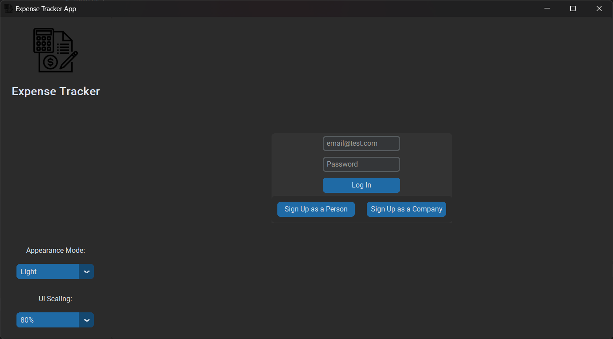
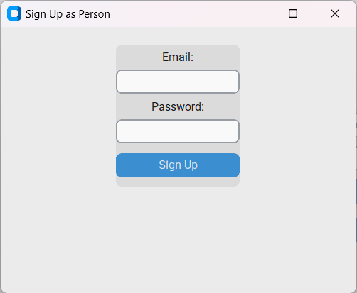
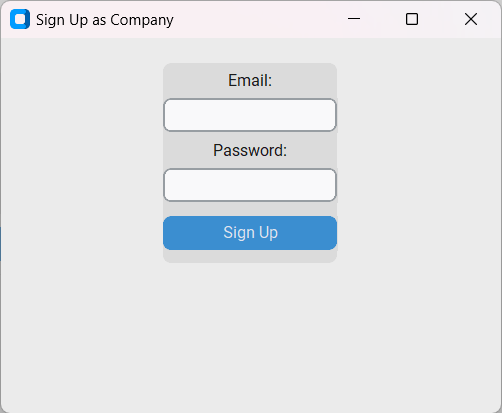
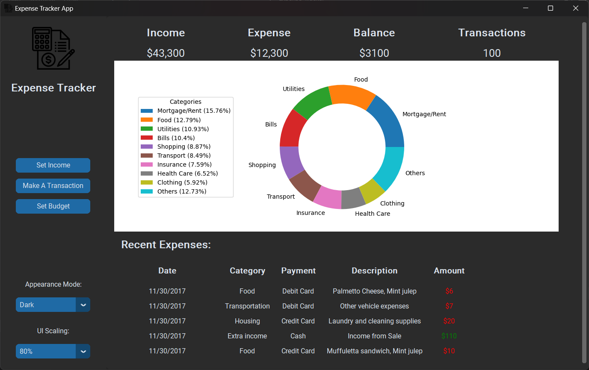
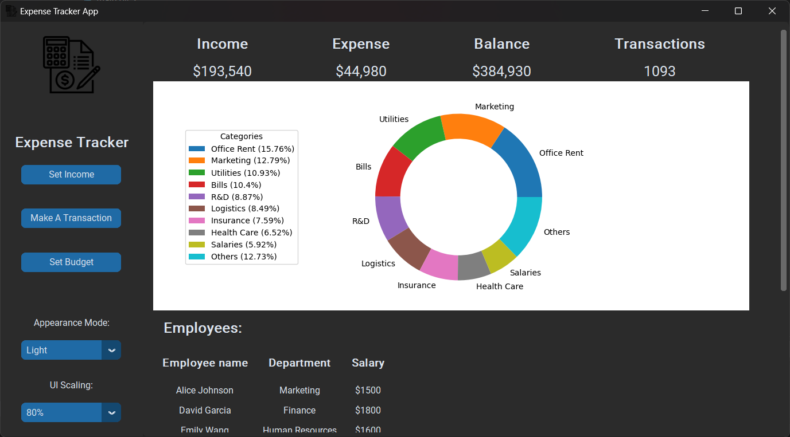

# Expense Tracker

Our team designed a desktop application that tracks the expenses of both individuals and companies or startups, and we developed a GUI for it.


## Description

The Expense Tracker application is a versatile tool designed to help both individuals and companies manage their expenses efficiently. The application offers a range of features that cater to the specific needs of different users.

### Key Features

- **Categories Management**: Add and edit categories for different expenses.
- **Budget Limits**: Set and monitor budget limits to control spending.
- **Monthly Reports**: Generate detailed reports analyzing spending habits.
- **Payment Reminders**: Automatic reminders for pending payments.

#### For Individuals
- **Savings Tracker**: View and manage personal savings.
- **Income Management**: Set and track income to manage finances better.
- **Budget Alerts**: Receive automated alerts to stay within budget.

#### For Companies and Startups
- **Employee Salary Management**: View and modify employees' salaries.
- **Bills Management**: Track company bills and expenses.
- **Project Expense Tracking**: Add and edit expenses for ongoing projects.
- **Department Reports**: Customized reports on departmental expenses.
- **Quarterly Reports**: Automated quarterly financial reports.
- **Employee Payments**: Pay employees directly through the app.

 ## Installation Instructions

To install the Expense Tracker application, follow these steps:

1. **Clone the Repository**:
    ```bash
    git clone https://github.com/MahmoudHamdy02/Expense-Tracker.git
    ```

2. **Install Required Dependencies**:
    All the required libraries and packages are inside requirements.txt.
    ```bash
    pip install requirements.txt
    ```
3. **Run the Application**:
    ```bash
    python main.py
    ```

## Usage

1. **Login or Sign Up**:
   - Upon running the application, a login page will open. If you do not have an account, you can choose to sign up as a company or as an individual user.
   
   
   

3. **Dashboard**:
   - After logging in, the dashboard for the user or company will open, displaying various options and features.

   

   

5. **Explore Features**:
   - Navigate through the GUI to add, edit, and manage expenses.
   - Utilize the reporting features to generate monthly and quarterly reports.

## Contributers

- Ahmed Abdelrahman Ahmed Abdelrahman    2002126
- Mahmoud Hamdy Mohamed Mostafa          2001300
- Mariam Hesham Abd El-Hamid             2000943
- Marten Ehab Fouad                      2101642
- Mohammed Yasser Mohammed               2002085
- Omar Salah Mansour Abdelkader          2002081
- Sara Ashraf Abdelhakam                 2000337
